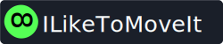

<h1 align="center">
  
</h1>

  

  

  

  

  
  
  

### Project developed during the 4th NextLevelWeek, event promoted by @Rocketseat, with some extras: D

The project consists of a system based on rewards for users to perform exercises after a certain time interval marked by a cycle. Upon completion of the cycle a notification is sent and the user receives a challenge with an exercise.Exercises are provided for the user's body and vision. After completing each exercise the user receives a reward in XP and as he progresses he goes up a level, getting progressively more difficult to level up.

